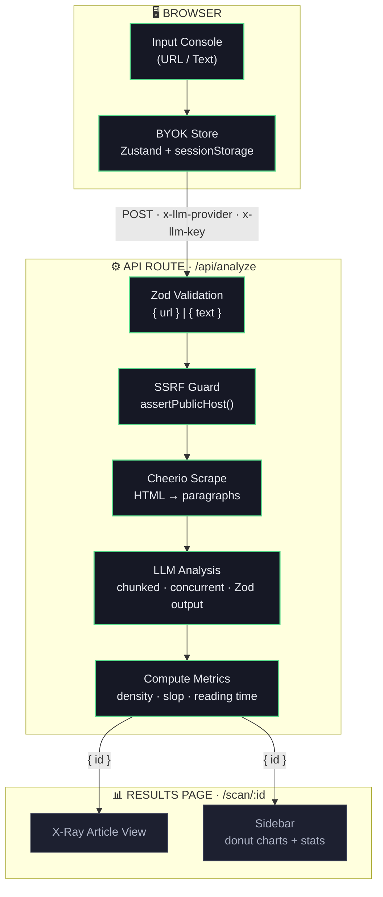
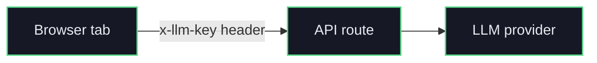

<div align="center">

```
                        ╔═══════════════════════════════════════╗
                        ║                                       ║
                        ║     ┌───────────────────────────┐     ║
                        ║     │  ◉                        │     ║
                        ║     │     ╱╲     S L O P        │     ║
                        ║     │    ╱  ╲    S H R I N K    │     ║
                        ║     │   ╱ ◉  ╲                  │     ║
                        ║     │  ╱──────╲                 │     ║
                        ║     │  ╲  ◉   ╱  v0.1.0         │     ║
                        ║     │   ╲    ╱                  │     ║
                        ║     │    ╲  ╱  information-     │     ║
                        ║     │     ╲╱   density scanner  │     ║
                        ║     │     ◉                     │     ║
                        ║     └───────────────────────────┘     ║
                        ║                                       ║
                        ╚═══════════════════════════════════════╝
```

# **SLOPSHRINK**

### `// information-density scanner`

**X-ray any article. Collapse the filler. Spotlight the facts.**

`Read less. Learn more.`


<br/>

---

</div>

## `// the reframe`

The internet is full of content nobody checked. Most detectors ask the wrong
question: *"was this written by AI?"* But a human can write pure filler, and a
model can write a dense, verifiable brief. Provenance is not quality.

> **Not "is this AI?", but "is this actually useful?"**

SlopShrink scans every paragraph, pinpoints exactly where quality breaks,
surfaces the verifiable facts a skim would miss, and makes low-effort filler
visible at a glance. Read the signal, skip the padding.

---

## `// how it works`

SlopShrink runs every paragraph through a 3-stage diagnostic pipeline:


---

## `// live density readout`

Here's what a scan result looks like. Every paragraph scored, classified, and annotated:

| # | Density | Score | Verdict | Excerpt |
|:---:|:---|:---:|:---:|:---|
| 01 | `███████████████████░` | **94** | 🟢 FACT | "DeepMind's Gemini 2.0 Flash processes 1M tokens…" |
| 02 | `██░░░░░░░░░░░░░░░░░░` | **12** | 🔴 SLOP | "In today's rapidly evolving landscape of AI…" |
| 03 | `██████████████████░░` | **91** | 🟢 FACT | "Pricing drops to $0.10/1M input tokens, 87% cheaper…" |
| 04 | `██░░░░░░░░░░░░░░░░░░` | **09** | 🔴 SLOP | "It's worth noting that this development is particularly…" |
| 05 | `██████████████████░░` | **88** | 🟢 FACT | "Context window expanded from 128K to 1M tokens…" |

> **Overall density** `62/100` &nbsp;·&nbsp; **Slop** 2 / 5 (40%) &nbsp;·&nbsp; **Facts extracted** 4 &nbsp;·&nbsp; **Reading time saved** ~1.2 min

---

## `// accuracy engine` · why the scores hold up

Detection is 30% of the score, so accuracy isn't a prompt. It's a pipeline.
Every layer exists to kill a specific failure mode:

| Layer | What it does |
|:---|:---|
| **Calibrated rubric** | 0–100 scale with five banded definitions and worked examples, scored on the *proportion* of signal, not length. Eloquent padding still scores low. |
| **Deterministic** | `temperature: 0`, so the same paragraph gets the same score. No dice-roll verdicts. |
| **Self-consistency** | `reconcile()` cross-checks the three signals: real extracted facts force `isSlop=false` and a score floor; factless generic text is pinned as slop. The model can't contradict itself. |
| **Index-locked align** | Each paragraph is labeled `[n]`; `alignByIndex()` re-seats every result by its echoed index, so a verdict can never land on the wrong paragraph. |
| **Zero fabrication** | Facts are extracted *only* from on-page text: no outside knowledge, no inference, no invented figures. If there's nothing, the array is empty. |
| **Graceful fallback** | A dropped paragraph degrades to a neutral score instead of corrupting the whole scan. |

The scoring rubric, with the exact calibration the model is held to:

| Band | Meaning |
|:---:|:---|
| **0–20** | Pure filler: clichés, hype, throat-clearing, restated generalities |
| **21–40** | Mostly filler with a stray weak detail |
| **41–60** | Mixed: a real point diluted by padding or vague framing |
| **61–80** | Mostly substance: specific claims with some connective filler |
| **81–100** | Dense: almost every sentence carries hard, verifiable information |

---

## `// scan diagnostics` · Key Metrics

| Metric | Value | Notes |
|:---|:---|:---|
| Density scale | 0 – 100 | Per-paragraph scoring |
| Max paragraphs | 80 | Hard cap per scan |
| Min input words | 50 | Threshold enforced |
| LLM providers | 5 | OpenAI · Anthropic · Google · OpenRouter · Ollama |
| Reading speed | 230 wpm | For time-saved calc |
| Max output tokens | 8,192 | LLM structured output |
| Batch chunk size | 12 paragraphs | Per LLM request |
| Max concurrency | 4 | Parallel chunk passes |
| LLM retries | 2 | Auto-retry on failure |
| Fetch timeout | 10 seconds | Per URL request |
| Max page size | 2 MB | Content-length guard |
| Max redirects | 5 | Following chain |
| Density weighting | Word-weighted | Not a simple average |

---

## `// diagnostic capabilities`

| Capability | What it does |
|:---|:---|
| ◉ **URL scanning** | Paste any URL. Cheerio strips nav, ads, cookie banners, and scripts, then extracts clean `<p>`, `<li>`, and `<blockquote>` text. |
| ◉ **Raw text input** | Drop in any block of text (articles, docs, newsletters, transcripts) and get it scored. |
| ◉ **X-Ray mode** | Toggle on: slop paragraphs collapse to a single line (click to reveal), and dense paragraphs spotlight extracted facts in callout boxes. |
| ◉ **Density scoring** | Every paragraph gets a 0–100 score with a color-coded edge bar: 🟢 signal, 🟡 mid-density, 🔴 slop. |
| ◉ **BYOK architecture** | Bring Your Own Key. Keys live in browser `sessionStorage` only, never touch the server, and clear on tab close. |
| ◉ **Multi-provider** | OpenAI · Anthropic · Google Gemini · OpenRouter · Ollama (local), each on a locked best-tier model. |
| ◉ **SSRF protection** | Blocks localhost, private IPs, IPv6 loopback, and link-local addresses, and validates the content-type is HTML. |
| ◉ **Accessibility** | Respects `prefers-reduced-motion` for all animations, keyboard navigable, with focus-visible outlines. |

---

## `// provider support matrix`

| Provider | Locked model | BYOK | Local option |
|:---|:---|:---:|:---:|
| OpenAI | `gpt-5.4-mini` | ✅ | ❌ |
| Anthropic | `claude-haiku-4-5` | ✅ | ❌ |
| Google | `gemini-3.5-flash` | ✅ | ❌ |
| OpenRouter | `openai/gpt-5.4-mini` | ✅ | ❌ |
| Ollama | `llama3.3` | ✅ | ✅ localhost |

All providers use structured output (JSON) with Zod v4 schema validation. Models are locked to each provider's cost-efficient workhorse tier: the best balance of capability and price for high-volume structured analysis, every one with first-class structured-output support.

---

## `// signal pipeline` · Architecture



---

## `// instrument panel` · Tech Stack

| Layer | Tool | Detail |
|:---|:---|:---|
| Framework | Next.js 16.2.6 | App Router + React Compiler |
| UI library | React 19.2.4 | with `babel-plugin-react-compiler` |
| Language | TypeScript 5+ | strict mode, bundler resolution |
| Styling | Tailwind CSS v4 | PostCSS + radiology dark theme |
| Animation | Motion 12.40 | Framer Motion successor |
| State | Zustand 5.0 | vanilla + persist middleware |
| AI SDK | Vercel AI SDK v6 | `generateObject()` + streaming |
| Schema | Zod v4.4 | compile-time type verification |
| Scraping | Cheerio 1.2 | HTML → clean paragraphs |
| UI primitives | @base-ui/react | Dialog, Select, Autocomplete |
| Design system | shadcn/ui | base-nova style |
| Icons | Lucide React | 170+ icon set |
| Fonts | IBM Plex Sans | + IBM Plex Mono + Spectral |

---

## `// sterilization protocol` · Security

**SSRF guard.** `assertPublicHost()` refuses to fetch:

- ❌ `localhost` / `127.0.0.1` / `::1`
- ❌ RFC 1918 private IPs (`10.x`, `172.16–31.x`, `192.168.x`)
- ❌ link-local (`169.254.x`, `fe80::`)
- ❌ IPv6 ULA / LLA
- ❌ content-type ≠ `text/html`
- ❌ page size > 2 MB
- ❌ redirects > 5

**BYOK key lifecycle.** Your key never lands on the server:



- Keys stored in `sessionStorage` (cleared on tab close)
- Never stored server-side
- Sent via custom HTTP headers only
- Zero `.env` files required

---

## `// boot sequence` · Getting Started

```bash
  # ◉ step 1 · clone the repo
  git clone https://github.com/SujalXplores/slop-shrink.git
  cd slop-shrink

  # ◉ step 2 · install dependencies
  npm install

  # ◉ step 3 · start the scanner
  npm run dev
```

```
  ◉ Ready at http://localhost:3000
```

> **No `.env` file needed. No API keys in config.**
> Open the app → click the key icon → enter your API key → paste a URL → scan.

---

## `// available commands`

| Script | Command | Purpose |
|:---|:---|:---|
| `npm run dev` | `next dev` | Start dev server |
| `npm run build` | `next build` | Production build |
| `npm run start` | `next start` | Serve production build |
| `npm run lint` | `eslint` | Run ESLint |

---

## `// file manifest` · Project Layout

```
  slop-shrink/
  │
  ├── app/
  │   ├── layout.tsx              ◉ Root layout, fonts, metadata, dark theme
  │   ├── page.tsx                ◉ Home page · input console + how-it-works
  │   ├── globals.css             ◉ Radiology dark theme, atmosphere effects
  │   ├── icon.tsx                ◉ Dynamic favicon (X-ray crosshair SVG)
  │   ├── apple-icon.tsx          ◉ Apple touch icon
  │   ├── robots.ts               ◉ Crawler rules
  │   ├── sitemap.ts              ◉ Sitemap generation
  │   ├── api/
  │   │   └── analyze/route.ts    ◉ POST: {url} | {text} → analysis → {id}
  │   └── scan/
  │       └── [id]/page.tsx       ◉ Dynamic scan results (Server Component)
  │
  ├── components/
  │   ├── input-hero.tsx          ◉ Main input form (URL/text toggle, word count)
  │   ├── key-modal.tsx           ◉ BYOK API key modal
  │   ├── site-header.tsx         ◉ Sticky header with status indicators
  │   ├── xray-article.tsx        ◉ X-Ray article view (collapse/expand/facts)
  │   ├── xray-sidebar.tsx        ◉ Stats dashboard (donut chart, metrics)
  │   ├── xray-toggle.tsx         ◉ Floating X-Ray mode toggle
  │   ├── providers/              ◉ Zustand store context providers
  │   └── ui/                     ◉ Design-system primitives (shadcn/ui)
  │
  ├── lib/
  │   ├── analyze.ts              ◉ Scan orchestration + derived metrics
  │   ├── scrape.ts               ◉ URL → clean paragraphs (SSRF guard)
  │   ├── llm/
  │   │   ├── index.ts            ◉ analyzeParagraphs() · Vercel AI SDK call
  │   │   ├── schema.ts           ◉ Zod schemas + compile-time type proof
  │   │   └── registry.ts         ◉ Model resolver (provider → LanguageModel)
  │   ├── types.ts                ◉ ParagraphAnalysis, ScanResult types
  │   ├── errors.ts               ◉ AppError, ScrapeError, LlmError classes
  │   ├── providers.ts            ◉ Provider registry (5 providers)
  │   ├── storage.ts              ◉ In-memory scan store (swap for prod)
  │   ├── byok.ts                 ◉ BYOK header encoding/decoding
  │   ├── byok-store.ts           ◉ Zustand store (sessionStorage)
  │   ├── xray-store.ts           ◉ X-Ray view Zustand store
  │   └── utils.ts                ◉ cn(), countWords(), densityTier()
  │
  └── public/                     ◉ Static assets
```

---

<div align="center">

## `// deployment status`

🟢 **Deployed on Vercel** &nbsp;·&nbsp; 🔗 **Live:** [slop-shrink.vercel.app](https://slop-shrink.vercel.app) &nbsp;·&nbsp; 💾 **Source:** [github.com/SujalXplores/slop-shrink](https://github.com/SujalXplores/slop-shrink)

---

```
  ╔═══════════════════════════════════════════════════════════════════╗
  ║                                                                   ║
  ║   Built with ◉ for the hackathon.                                 ║
  ║   No filler. No slop. Just signal.                                ║
  ║                                                                   ║
  ╚═══════════════════════════════════════════════════════════════════╝
```

</div>
